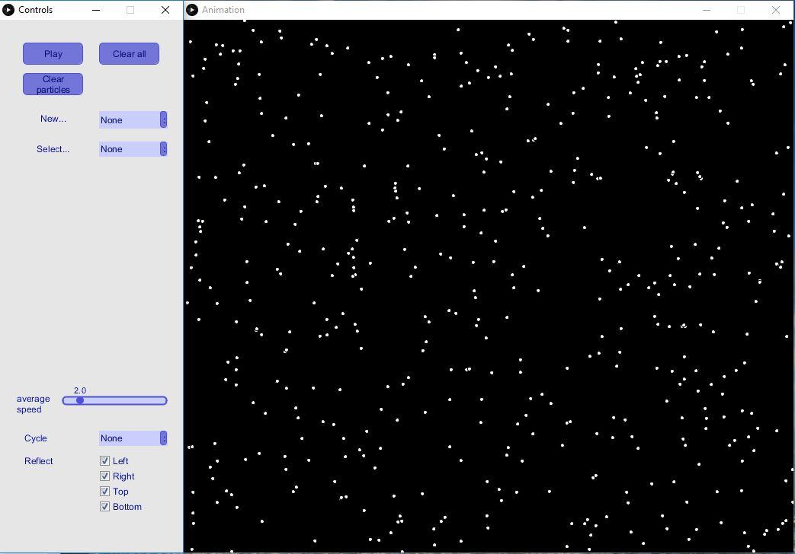
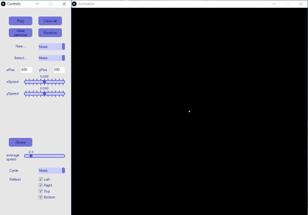
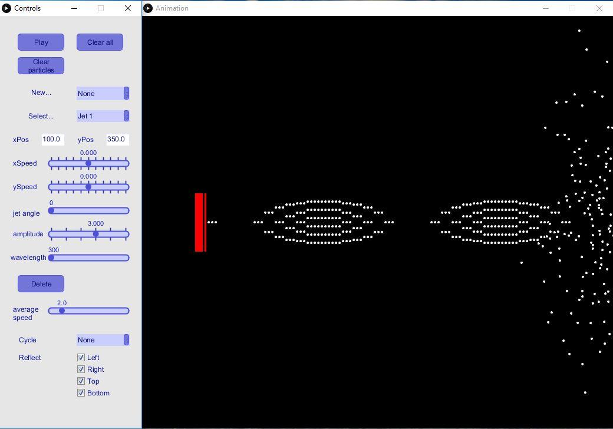
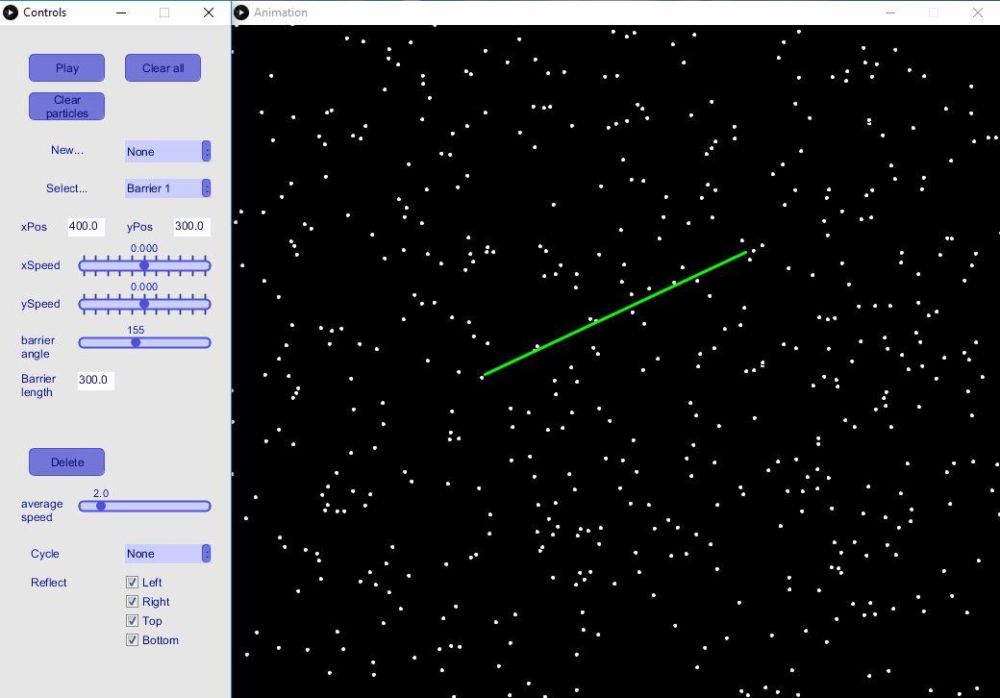

# Particle Waves
ParticleWaves uses computer animation to simulate 2D elastic collisions between particles. Additionally, the user can create barriers and sinusoidal particle jets to simulate a variety of particle and wave phenomena. The simulation is based on the laws of physics, under the following assumptions and simplifications: 

• All collisions between particles, and between particles and barriers, are elastic. That is, both momentum and energy are conserved.  
• All particles have equal radius and mass.  
• Rotation and spin effects are ignored.  
• Gravitational forces are ignored.  

<strong> Features </strong>  
<strong>A. Random distribution.</strong> By clicking the “Random” button, 500 particles are randomly distributed over the screen and given random initial velocities. The average speed is set by the slider below. Additional controls over random generation (number of particles, orientation, speed variance, etc.) have been conceptualized but not implemented.

If the user wants to generate a particle with a custom position and velocity, they can do so by selecting New → Particle. 

<strong>B. Jets.</strong> The user can create a new jet by selecting New → Jet. The user can specify the position and velocity of the jet, as well as the amplitude, angle, and wavelength of the particle wave that it generates. The user can edit these parameters later by clicking Select → Jet #. 

<strong>C. Barriers.</strong> The user can create a new barrier by selecting New → Barrier. The user can specify the position, length, and angle of the barrier. The user can also specify the velocity of the barrier, but moving barriers are not yet perfectly implemented.

The user can add as many jets and barriers as they please, but having more than 5 of either will cause the program to lag significantly. The user can also delete jets and barriers by pressing the “Delete”button.

<strong>D. Cycling and Reflection.</strong> Once there are more than 300 particles on the screen, the user can choose to generate jet particles by redrawing particles from the left and/or right sides of the screen at the jets’ positions. This prevents excessive particle buildup and reduces lag. If there are more than 1600 particles, the program will automatically switch to “Multi” cycling, in which particles are randomly pulled from the right or left side of the screen.

The user can also toggle particle reflection off the sides of the screen to suit their needs. For example, a simulation of the Doppler effect would work best with reflection turned off on at least two sides of the screen; the side towards which the particles are moving, and the side towards which the jets are moving.

<strong>Inputs to the program</strong>  
• The average speed of the particles 
• Number of jets and/or barriers 
• The position, velocity, and angle of a jet or barrier 
• The amplitude and wavelength of a jet particle wave 
• The length of a barrier 
• Particle cycling settings 
• Reflection settings
